# Цель работы

Изучить основы защиты данных ПК/телефона.

# Выполнение работы

1. Загрузочный сектор диска, как и другие сектора диска, можно зашифровать.

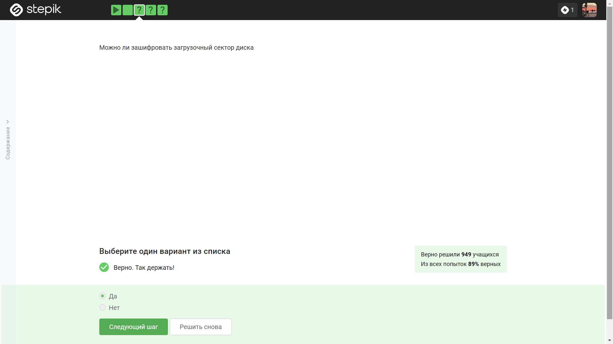

2. Шифрование диска основано на симметричном шифровании, как правило на алгоритме AES.

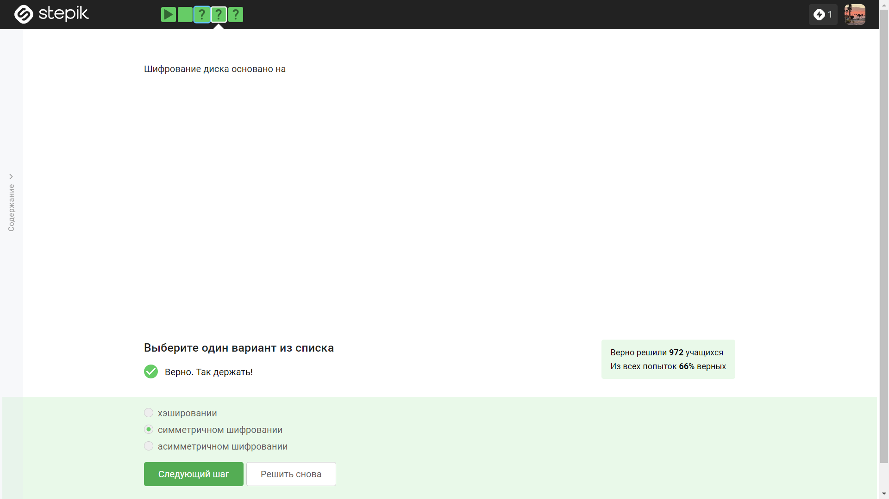

3. VeraCrypt и BitLocker - примеры программ, с помощью которых можно зашифровать жесткий диск.

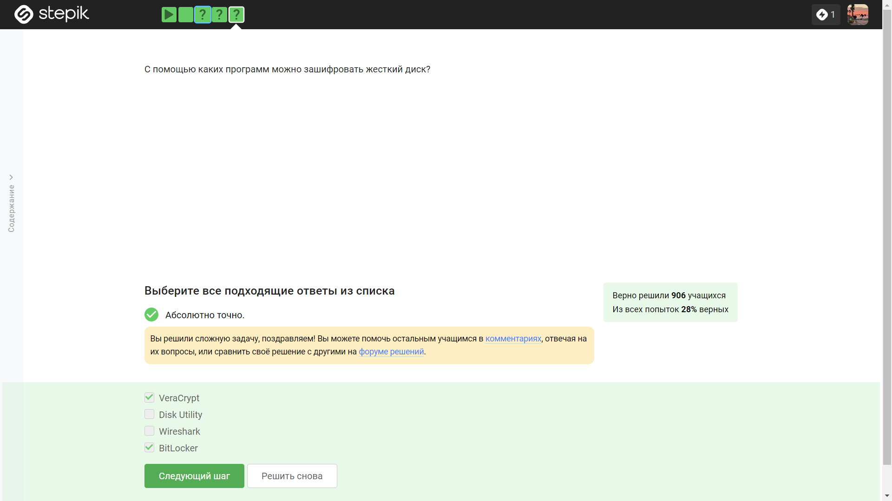

4.  К стойким паролям обычно относят пароли, содержащие большие и маленькие буквы алфавита, цифры, специальные символы, не имеющие реальной смысловой нагрузки, выберем такой пароль из списка.

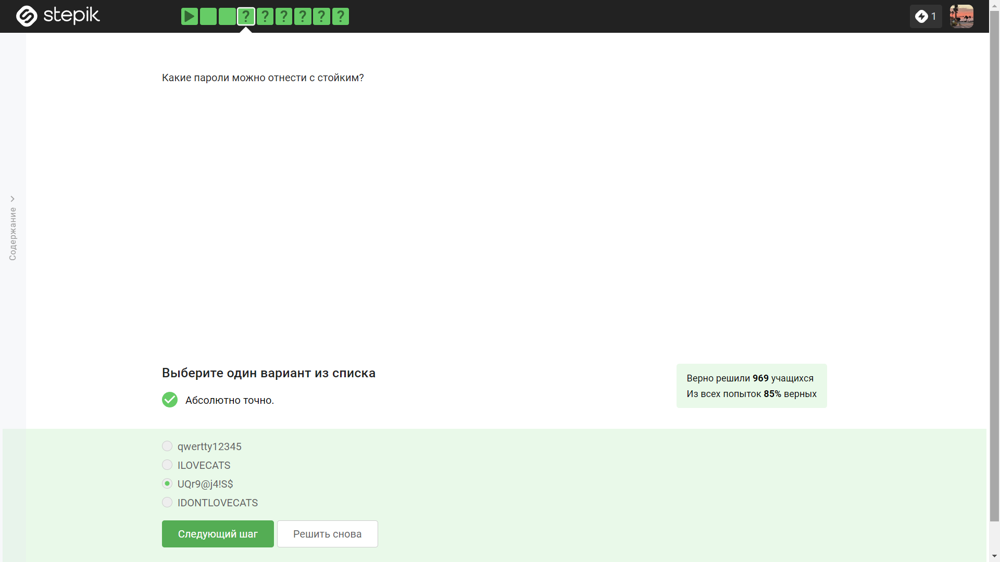

5. Менеджеры паролей являются самым безопасным методом хранения паролей.

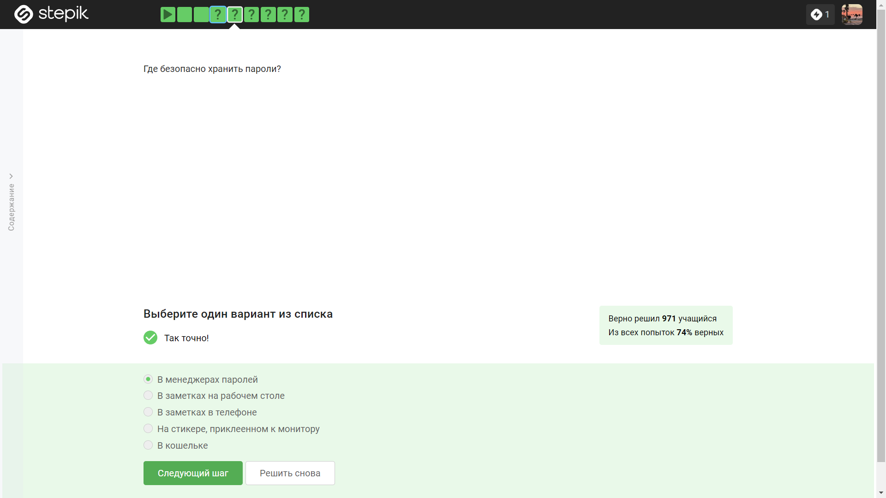

6. Капча нужна для защиты от автоматизированных атак, направленных на получение несанкционированного доступа, она не используется для замены паролей, защиты кук пользователя, безопасного хранения паролей на сервере.

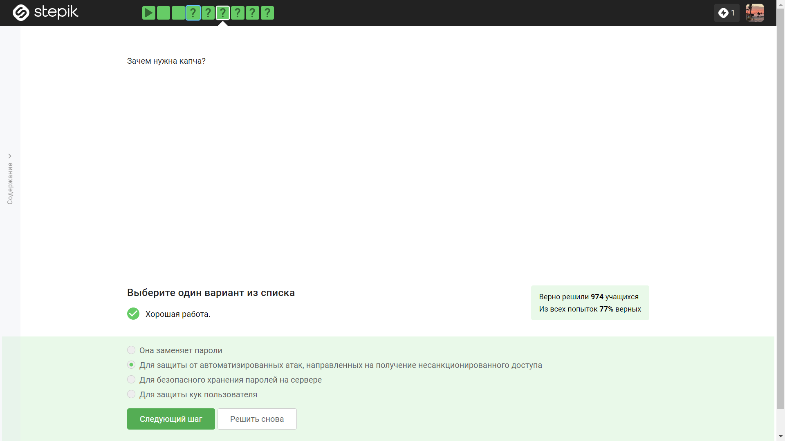

7. Хэширование паролей нужно для того, чтобы не хранить пароли на сервере в открытом виде, для конфиденциальности паролей пользователей.

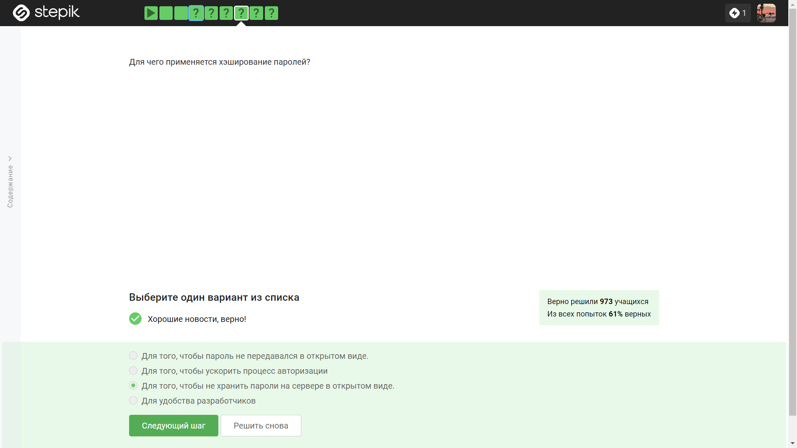

8. Соль для улучшения стойкости паролей не поможет, если злоумышленник получил доступ к серверу, так как она хранится на сервере.

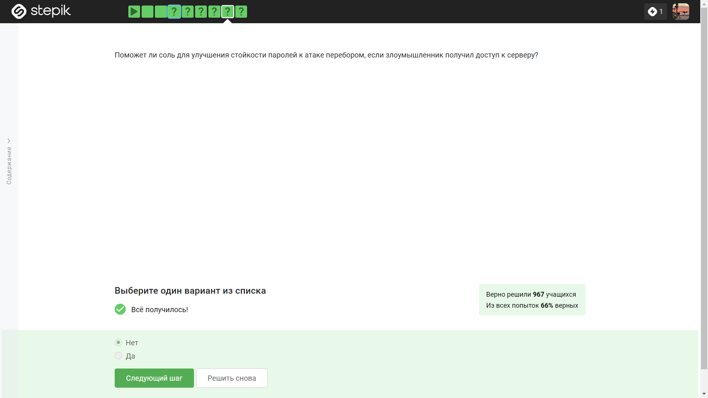

9. Разные пароли на всех сайтах, периодическая смена паролей, сложные пароли, капча защищают от утечек данных атакой перебором. 

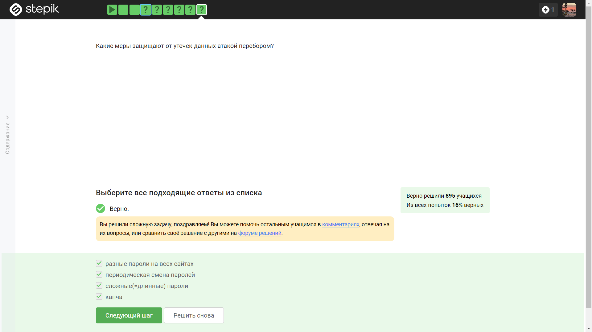

10. Среди представленных ссылок, ссылка для входа в сбербанк и для входа в яндекс являются фишинговыми, так как не имеют никакого отношения к сбербанку и яндексу соответственно.

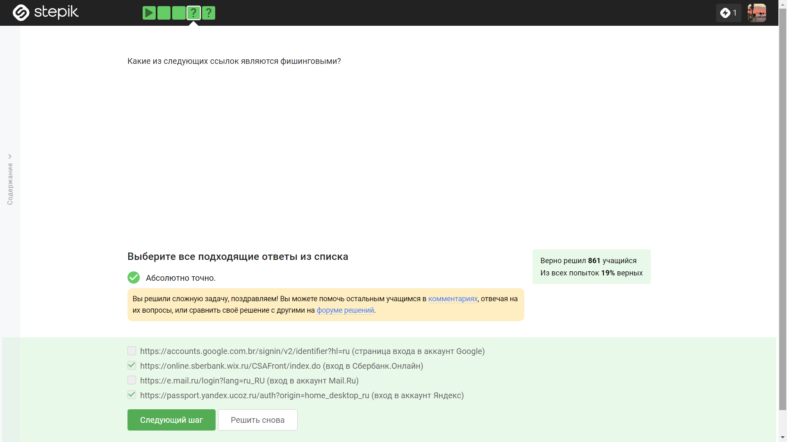

11. Фишинговый имейл может прийти от знакомого адреса, этот вид фишинга называется спуфинг.

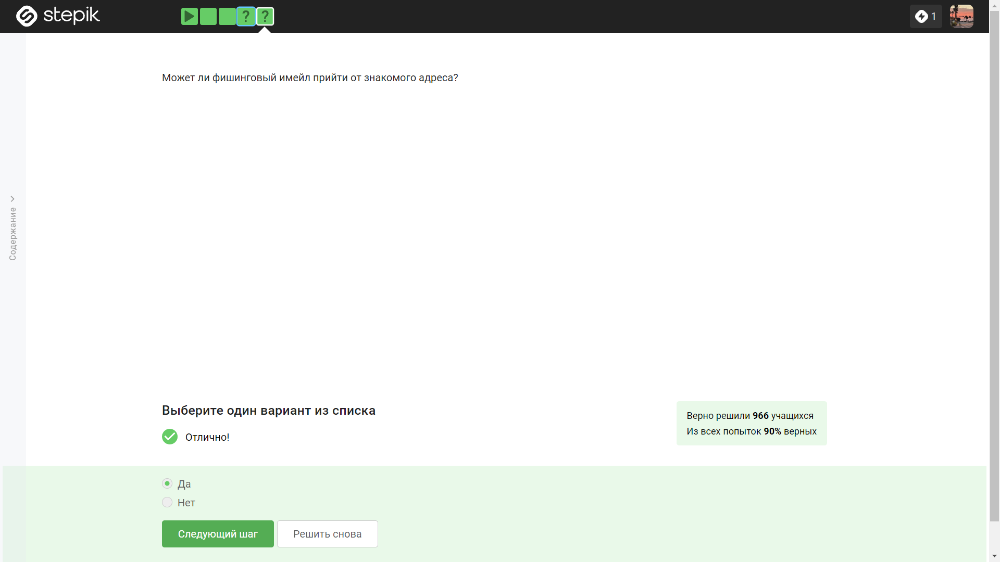

12. Спуфинг - это подмена адреса отправителя в имейлах, вид фишинга.

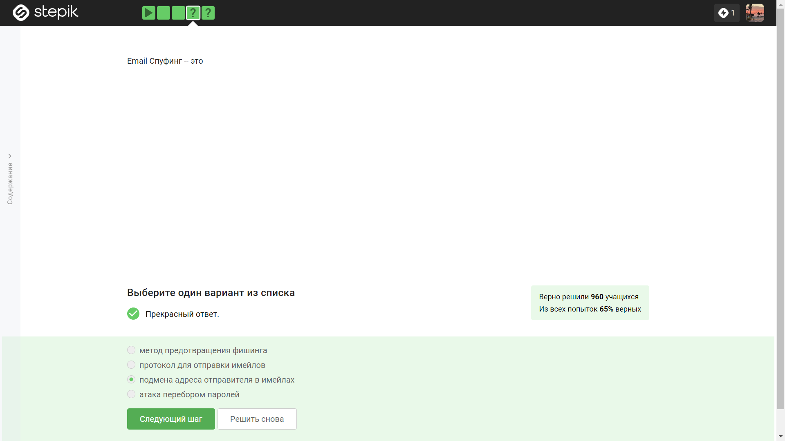

13. Вирус-троян маскируется под легитимную программу, при этом содержа в себе вредоносное ПО.

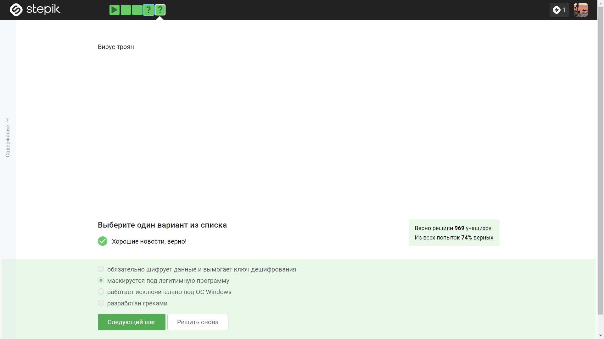

14. В протоколе мессенджеров Signal ключ шифрования формируется при генерации первого сообщения стороной-отправителем.

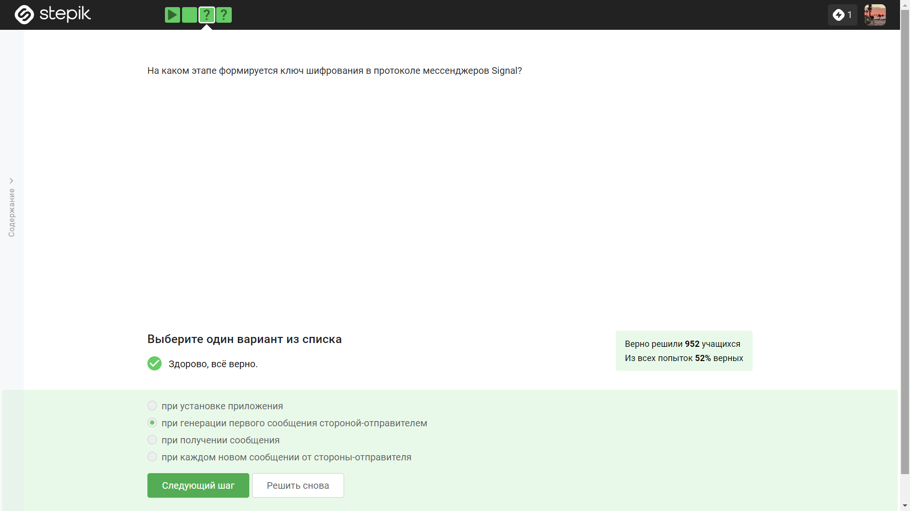

15. Суть сквозного шифрования состоит в том, что сообщения передаются по узлам связи (серверам) в зашифрованном виде.

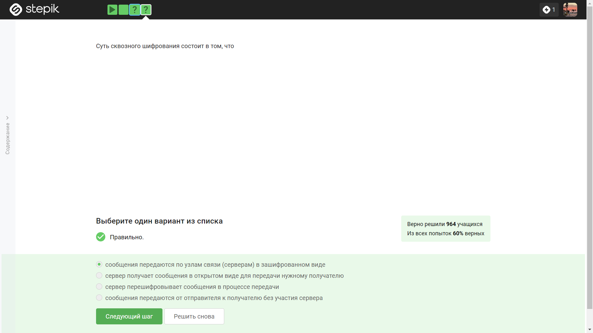

# Выводы

Я изучил основы защиты данных ПК/телефона.

# Список литературы

Конспекты к лекциям курса "Основы кибербезопасности".
