# Цель работы

Изучить основы криптографии.

# Выполнение работы

1. В асимметричных криптографических примитивах обе стороны имеют пару ключей - публичный и секретный.

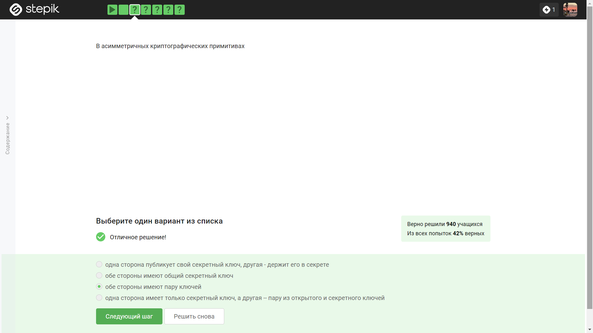

2. Криптографическая хэш-функция, в отличие от обычной хэш-функции, не обеспечивает конфиденциальность захэшированных данных, но она стойкая к коллизиям, эффективно вычисляется, дает на выходе фиксированное число бит независимо от объема входных данных.

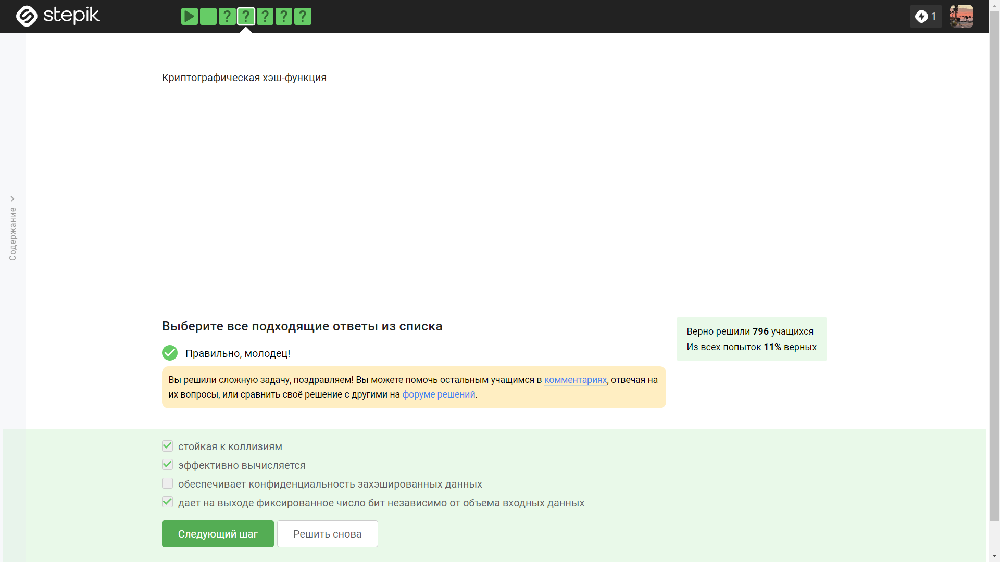

3. К алгоритмам цифровой подписи относятся зарубежные RSA и ECDSA, российский ГОСТ Р 34.10-2012.

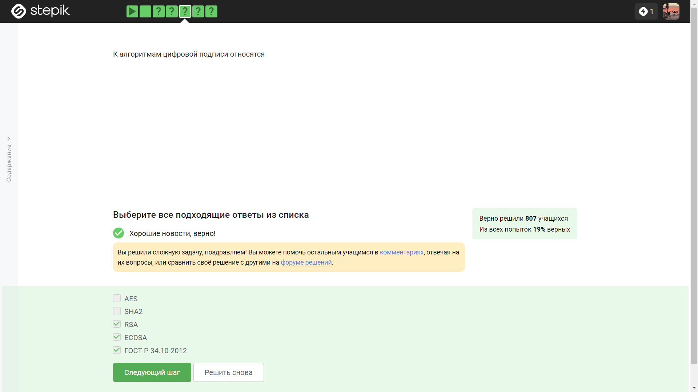

4.  Код аутентификации сообщения относится к симметричным примитивам.

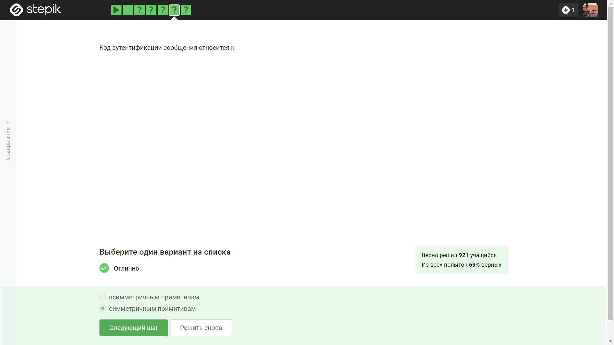

5. Обмен ключами Диффи-Хэллмана - это асимметричный примитив генерации общего секретного ключа.

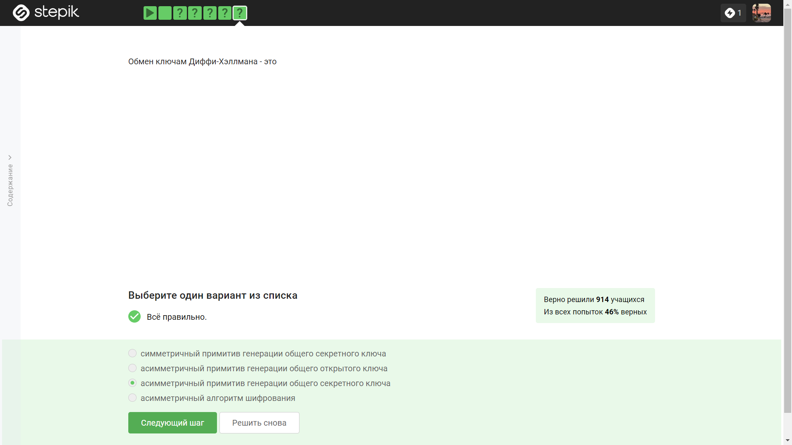

6. Протокол электронной цифровой подписи относится к протоколам с публичным ключом.

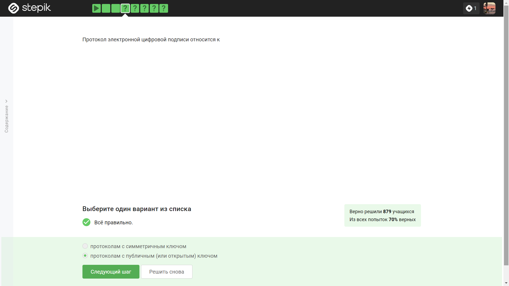

7. Алгоритм верификации электронной цифровой подписи требует на вход подпись, открытый ключ, сообщение.

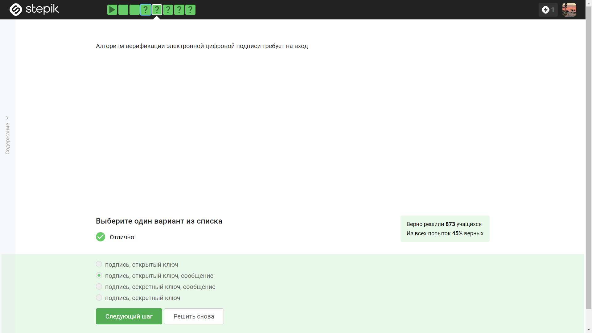

8. Электронная цифровая подпись не обеспечивает конфиденциальность.

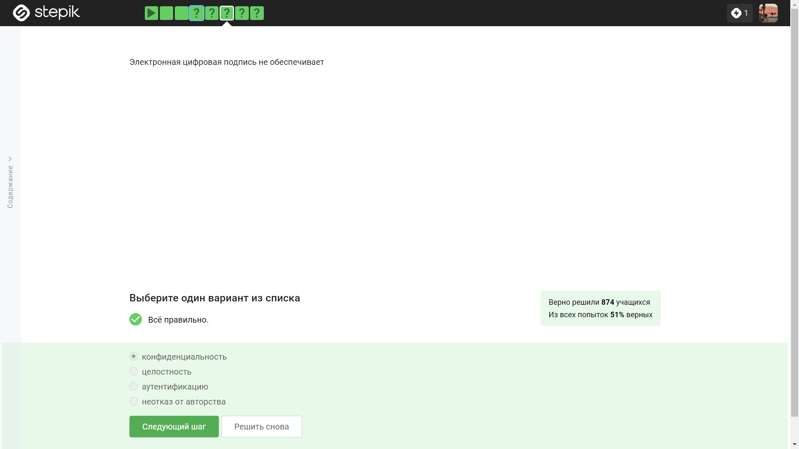

9. Для отправки налоговой отчетности в ФНС понадобится самый сильный тип сертификата электронной подписи - усиленная квалификационная.

10. Квалифицированный сертификат ключа проверки электронной подписи можно получить в удостоверяющем (сертификационном) центре.

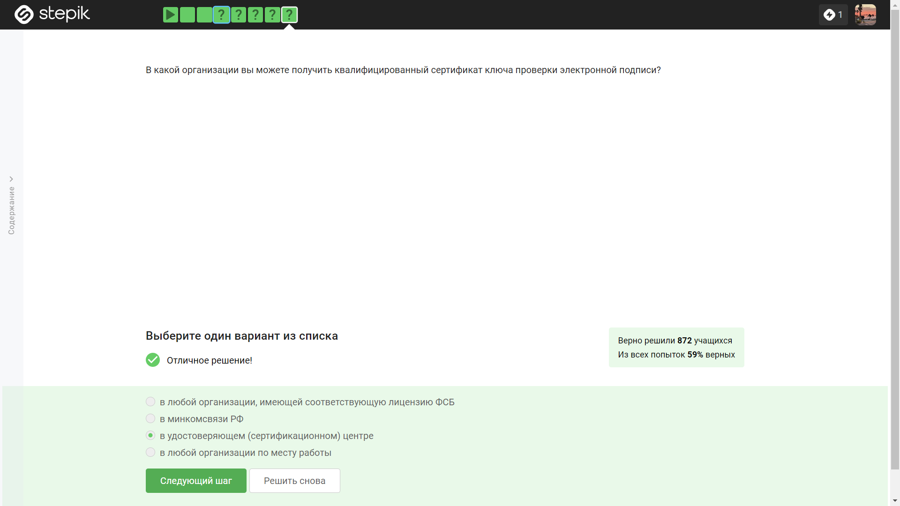

11. MasterCard и МИР являются платежными системами в предоставленном в задании списке.

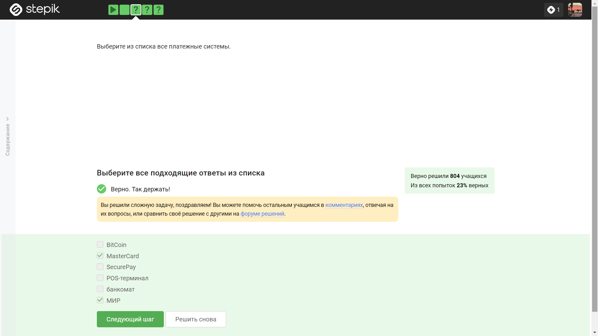

12. Примерами многофакторной аутентификации являются комбинация проверка пароля + код в sms сообщении, комбинация код в sms сообщении + отпечаток пальца, капча с паролем и пароль с пин кодом не являются примерами многофакторной аутентификации.

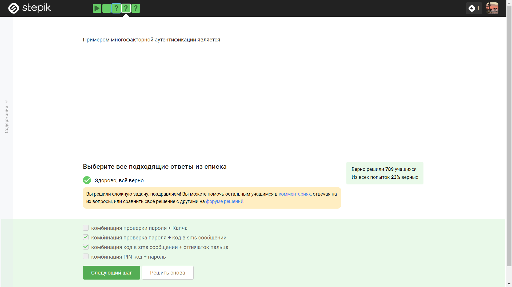

13. При онлайн платежах сегодня используется многофакторная аутентификация покупателя перед банком-эмитентом - банком, на счете которого покупатель хранит денежные средства.

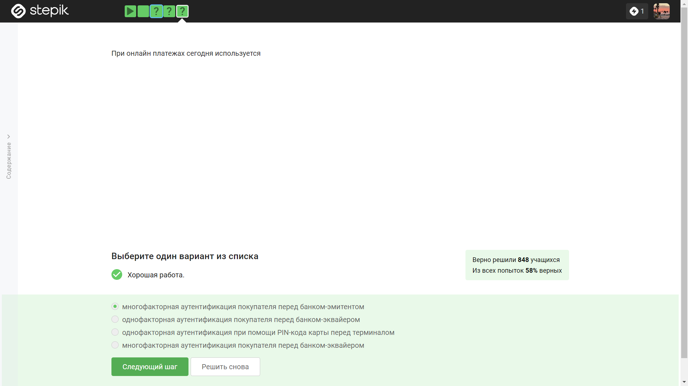

14. Сложность нахождения прообраза как свойство криптографической хэш-функции используется в доказательстве работы майнера.

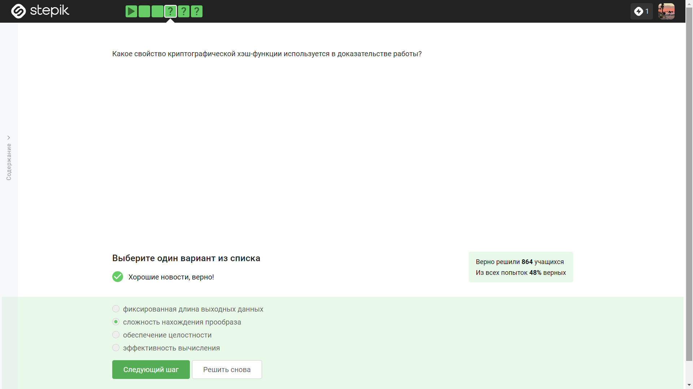

15. Консенсус в некоторых системах блокчейн обладает свойствами: открытость, живучесть, постоянство.

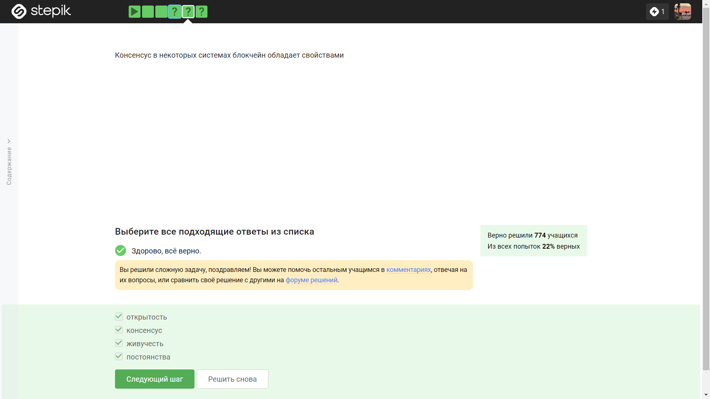

16. Цифровая подпись используется в качестве криптографического примитива в блокчейне.

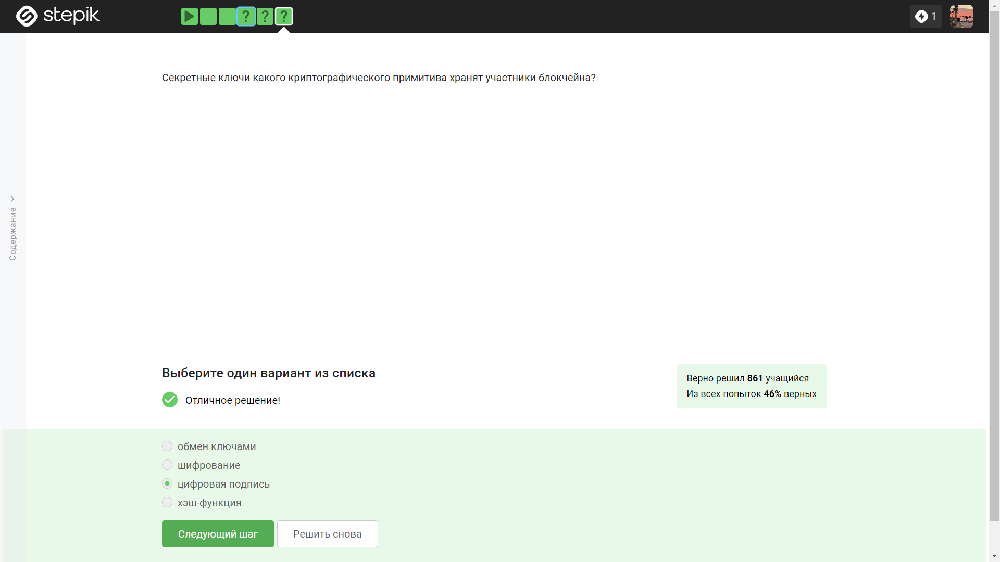

# Выводы

Я изучил основы криптографии.

# Список литературы

Конспекты к лекциям курса "Основы кибербезопасности".
